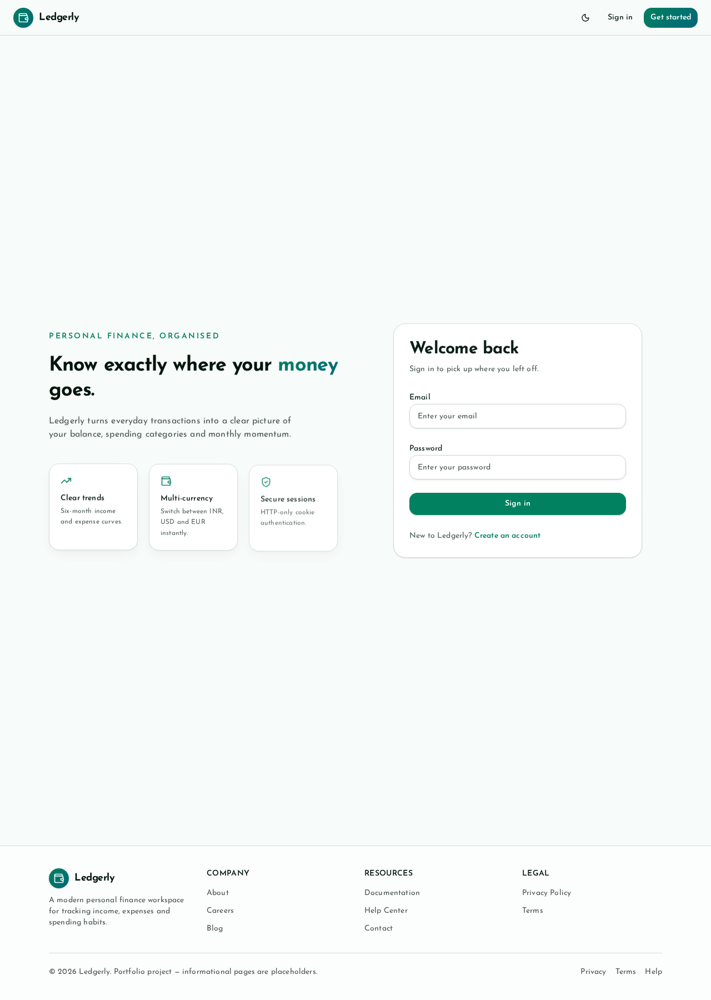
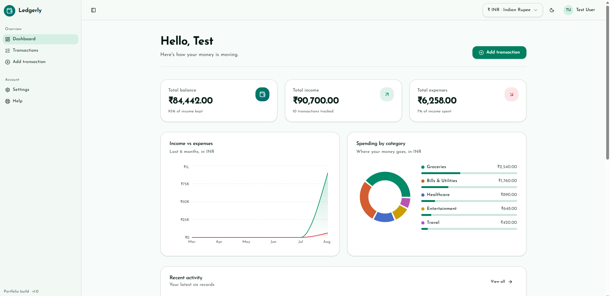
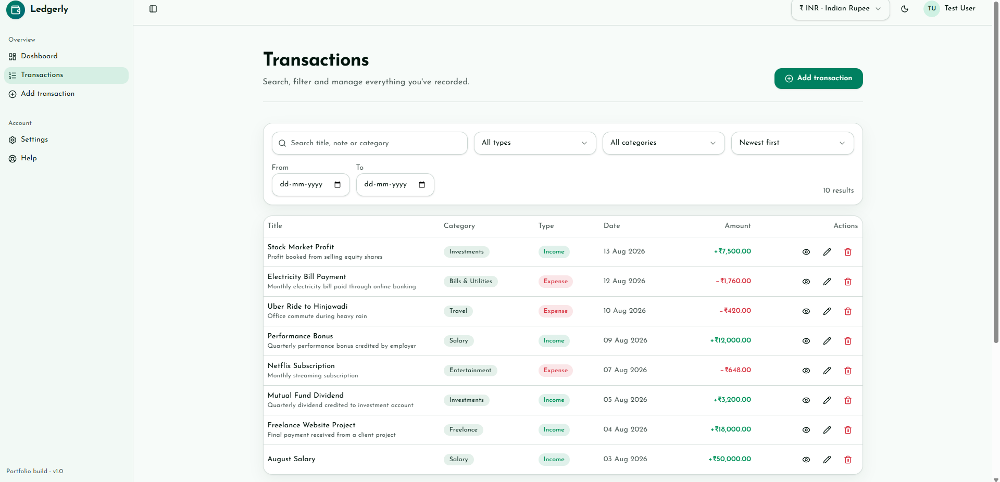
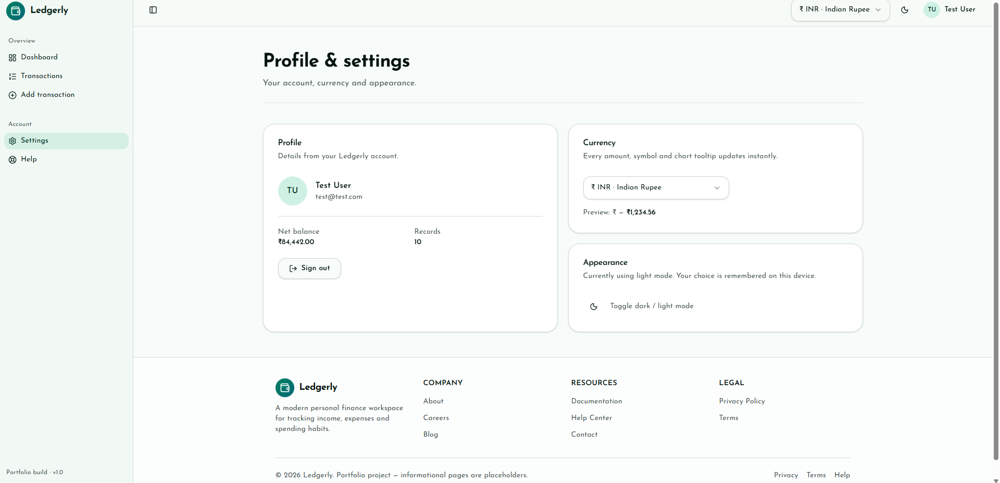

## Live Demo

Frontend: https://ledgerly-rust-eight.vercel.app

# Ledgerly

A modern full-stack personal finance tracker that helps users manage income, expenses, categories, and spending trends with secure authentication and a polished responsive interface.

## Overview

Ledgerly is a full-stack expense tracking application built with a modern TypeScript and React frontend and a secure Node.js backend. It supports user authentication with HTTP-only JWT cookies, transaction management, category-based analytics, currency preferences, dark/light mode, and a responsive dashboard experience.

## Screenshots

<p align="center">
  
  
</p>

<p align="center">
  
  
</p>

## Features

### Authentication

- Register and login with secure password hashing
- HTTP-only JWT cookie authentication
- Protected routes
- Persistent sessions across refreshes
- Logout support

### Dashboard

- Total balance overview
- Income and expense summaries
- Recent transactions
- Category breakdown
- Spending trends

### Transactions

- Create, edit, and delete transactions
- Income and expense support
- Category validation
- Search and filtering
- Sorting and pagination
- Transaction detail view

### Currency

- INR, USD, and EUR support
- User-specific currency preference
- Instant UI updates across dashboard, transactions, charts, and summaries

### User Experience

- Dark and light theme toggle
- Mobile-first responsive layout
- Smooth animations and transitions
- Toast notifications
- Loading, empty, and error states
- Modular component architecture

## Tech Stack

### Frontend

- React
- TypeScript
- TanStack Start
- TanStack Router
- TanStack Query (React Query)
- Vite
- Tailwind CSS
- shadcn/ui
- Zod
- Sonner
- Josefin Sans

### Backend

- Node.js
- Express.js
- MongoDB
- Mongoose
- JSON Web Tokens (JWT)
- bcrypt
- cookie-parser
- cors
- helmet
- express-rate-limit
- Zod

## Project Structure

```text
ledgerly/
├── client/
│   ├── src/
│   │   ├── components/
│   │   ├── contexts/
│   │   ├── hooks/
│   │   ├── routes/
│   │   ├── services/
│   │   ├── utils/
│   │   └── styles.css
│   ├── public/
│   ├── package.json
│   └── vite.config.ts
├── server/
│   ├── src/
│   │   ├── config/
│   │   ├── controllers/
│   │   ├── middlewares/
│   │   ├── models/
│   │   ├── routes/
│   │   ├── utils/
│   │   └── validations/
│   ├── package.json
│   └── .env
└── README.md
```

## API Endpoints

### Authentication

| Method | Endpoint            | Description         |
| ------ | ------------------- | ------------------- |
| POST   | /api/users/register | Register a new user |
| POST   | /api/users/login    | Login               |
| POST   | /api/users/logout   | Logout              |
| GET    | /api/users/me       | Get current user    |

### Transactions

| Method | Endpoint              | Description           |
| ------ | --------------------- | --------------------- |
| GET    | /api/transactions     | Get all transactions  |
| GET    | /api/transactions/:id | Get transaction by ID |
| POST   | /api/transactions     | Create transaction    |
| PATCH  | /api/transactions/:id | Update transaction    |
| DELETE | /api/transactions/:id | Delete transaction    |

### Currency

| Method | Endpoint      | Description               |
| ------ | ------------- | ------------------------- |
| PATCH  | /api/currency | Update preferred currency |

## Environment Variables

### Backend (server/.env)

```env
PORT=5000
MONGO_URI=your_mongodb_connection_string
JWT_SECRET=your_jwt_secret
CLIENT_URL=http://localhost:8080
```

### Frontend (client/.env.local)

```env
VITE_API_BASE_URL=http://localhost:5000
```

## Getting Started

### Clone the repository

```bash
git clone https://github.com/your-username/ledgerly.git
cd ledgerly
```

### Install dependencies

Backend

```bash
cd server
npm install
```

Frontend

```bash
cd ../client
npm install
```

### Run the application

Start the backend

```bash
cd server
npm run dev
```

Start the frontend

```bash
cd client
npm run dev
```

Open the application in your browser and create a new account.

## Validation

Ledgerly uses Zod schemas to validate:

- User registration
- User login
- Transaction creation
- Transaction updates
- Currency updates

Income and expense categories are validated independently to prevent invalid category combinations.

## Security

- Passwords hashed with bcrypt
- JWT authentication
- HTTP-only cookies
- CORS with credentials
- Helmet security headers
- Rate limiting
- Route protection middleware
- User ownership checks on all transaction operations

## Future Improvements

- Monthly budgets
- Recurring transactions
- CSV export/import
- Exchange-rate conversion
- Spending insights
- Charts by month and year
- Email verification
- Password reset

## Author

Built as a personal full-stack portfolio project using React, TanStack Start, Express, MongoDB, and modern TypeScript tooling.
